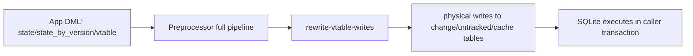

# Design Log #0002: Implement RFC 001 Preprocess Writes

## Background

See Design Log #0001 for architecture baseline.

RFC 001 (`rfcs/001-preprocess-writes/index.md`) proposes moving write handling out of SQLite vtable callbacks (`xUpdate`/`xCommit`) and into the SDK preprocessor.

Today, writes flow through:

- `state` and `state_by_version` INSTEAD OF triggers
- `lix_internal_state_vtable` callbacks
- per-row validation + side effects in JS

This adds high overhead for bulk writes.

## Problem

Per RFC 001, write operations should avoid vtable overhead and avoid the `lix_internal_transaction_state` staging table.

Current SDK internals are deeply coupled to `lix_internal_transaction_state` across:

- commit materialization,
- change view composition,
- version merge internals,
- read rewrite (`rewrite-vtable-selects`) candidate segments,
- runtime transaction flags and rollback handling.

So implementing RFC 001 as written is a cross-cutting migration, not a single preprocessor-step addition.

## Questions and Answers

### Q1: Should this implementation remove `lix_internal_transaction_state` now?

**Answer:** Yes. Implement RFC 001 as written.

### Q2: What write shapes are in scope for first implementation phase?

**Answer:**

- In scope: `INSERT ... VALUES`, `INSERT ... DEFAULT VALUES`, `UPDATE ... WHERE`, `DELETE ... WHERE`.
- Out of scope for first pass: `INSERT ... SELECT`.

### Q3: How should unsupported/unsafe write rewrites behave?

**Answer:** Follow existing read-preprocessor behavior: conservative/fail-safe fallback where rewrite cannot be guaranteed.

### Q4: How should validation semantics be preserved?

**Answer:** Reuse current validators first (same behavior contract), then optimize incrementally.

### Q5: What is the compatibility contract?

**Answer:** Keep public SQL/API behavior stable while changing internal write path architecture.

## Design

Replace vtable write execution with preprocessor-generated physical SQL and remove transaction-state staging.



### Phase annotations

- **Phase A (bridge):** add write rewrite step and prove parity for in-scope statements.
- **Phase B (migration):** remove transaction-state coupling from commit/change/merge/read-rewrite internals.
- **Phase C (cleanup):** remove obsolete schema/table/functions/tests.

### Type signatures (new/changed)

```ts
// new step
export const rewriteVtableWrites: PreprocessorStep

// likely helper contract for extracted validation + side effects
export type RewriteWriteResult = {
  statements: readonly SegmentedStatementNode[]
  rewritten: boolean
}
```

Validation rule contract for first pass:

- If statement shape is not fully understood, do not rewrite.
- If rewritten, enforce same constraints now enforced by `validateStateMutation(...)`.

## Exact Code Affected

### 1) Preprocessor pipeline + new rewrite step

- `packages/sdk/src/engine/preprocessor/create-preprocessor.ts`
  - Add `rewriteVtableWrites` into `fullPipeline` after entity-view DML rewrites.
- `packages/sdk/src/engine/preprocessor/steps/rewrite-vtable-writes.ts` (new)
  - Rewrite `INSERT`/`UPDATE`/`DELETE` targeting `state`, `state_by_version`, `lix_internal_state_vtable`.
  - Resolve active version for `state` writes.
  - Keep fallback behavior for unsupported shapes.
- `packages/sdk/src/engine/preprocessor/steps/rewrite-vtable-writes.test.ts` (new)

### 2) Remove transaction-state architecture

- `packages/sdk/src/state/transaction/schema.ts`
  - Remove DDL creation for `lix_internal_transaction_state`.
- `packages/sdk/src/state/transaction/insert-transaction-state.ts`
  - Delete or replace with new physical-write target helper(s).
- `packages/sdk/src/database/schema.ts`
  - Remove `lix_internal_transaction_state` from internal DB schema typing.

### 3) Rewrite vtable runtime dependencies

- `packages/sdk/src/state/vtable/vtable.ts`
  - Remove/neutralize `xUpdate` write path as primary route.
  - Remove transaction-table-based rollback/open-transaction checks.
  - Keep read vtable functionality only as needed for compatibility.
- `packages/sdk/src/state/vtable/commit.ts`
  - Replace commit flow currently sourced from transaction-state rows.
  - Re-anchor commit materialization to new write path outputs.

### 4) Rewrite read path assumptions that currently include transaction segments

- `packages/sdk/src/engine/preprocessor/steps/rewrite-vtable-selects.ts`
  - Remove transaction segment (`T`) and inherited transaction segment (`TI`) planning.
  - Recompute priority/ranking logic without transaction-state source.

### 5) Update other internals coupled to transaction table

- `packages/sdk/src/change/schema.ts`
  - Remove union branch that surfaces `lix_internal_transaction_state` in `change` view.
- `packages/sdk/src/version/merge-version.ts`
  - Remove read/delete logic against `lix_internal_transaction_state`.
- `packages/sdk/src/state/vtable/index.ts` (if exports need cleanup)

### 6) Tests and benches that must change

- `packages/sdk/src/state/vtable/vtable.test.ts`
- `packages/sdk/src/state/vtable/commit.test.ts`
- `packages/sdk/src/state/vtable/validate-state-mutation.test.ts`
- `packages/sdk/src/state/transaction/insert-transaction-state.test.ts`
- `packages/sdk/src/change/schema.test.ts`
- `packages/sdk/src/state/vtable/vtable.insert.bench.ts`
- `packages/sdk/src/state/vtable/commit.bench.ts`
- `packages/sdk/src/state/vtable/validate-state-mutation.bench.ts`

## Implementation Plan

### Phase 1: Add write preprocessor route

1. Add `rewrite-vtable-writes.ts` and wire into `fullPipeline`.
2. Implement in-scope rewrite targets (`INSERT VALUES/DEFAULT`, `UPDATE`, `DELETE`).
3. Keep fallback-safe behavior on unsupported shapes.

### Phase 2: Migrate away from transaction table

1. Remove transaction-table writes from runtime path.
2. Replace commit/materialization logic in `commit.ts`.
3. Update change/merge/read-rewrite logic that assumes pending transaction rows.

### Phase 3: Remove obsolete code + stabilize

1. Remove `lix_internal_transaction_state` schema/types/helpers.
2. Update all coupled tests/benches.
3. Validate behavior + performance targets from RFC.

## Examples

✅ Good first-pass rewrite target:

```sql
UPDATE state_by_version
SET snapshot_content = ?
WHERE schema_key = ? AND entity_id = ? AND version_id = ?
```

✅ Good fallback (first pass):

```sql
INSERT INTO state_by_version (...) SELECT ...
```

❌ Bad migration pattern:

- Keep `rewrite-vtable-selects.ts` transaction segments while removing `lix_internal_transaction_state`.

❌ Bad compatibility behavior:

- Changing public SQL contracts (`state`, `state_by_version`) during internal migration.

## Trade-offs

- Implements RFC intent fully, but touches many internals at once.
- Higher migration risk than incremental non-breaking approach.
- Conservative rewrite fallback reduces correctness risk but delays some performance wins until parser/rewrite coverage expands.

## Implementation Notes (planned)

- This work is an internal architecture migration with stable external API goals.
- Any behavior deviation must be recorded in an `Implementation Results` append section in this log.

## Implementation Results

### 2026-02-25 - Task 1 completed

- Completed Task 1 from `design-log/0002-preprocess-writes.tasks.json`.
- Added `packages/sdk/src/engine/preprocessor/steps/rewrite-vtable-writes.ts`.
- Current implementation is intentionally a no-op:
  - exports `rewriteVtableWrites: PreprocessorStep`
  - returns `context.statements` unchanged
- No runtime behavior changes introduced yet.

Notes that impact subsequent tasks:

- Task 2 should wire existing `rewriteVtableWrites` export into `fullPipeline` only.
- Tasks 3-6 and 11/13/14 should iterate directly in `rewrite-vtable-writes.ts` first to keep early rewrite behavior localized.
- Keep fallback-safe contract unchanged while moving from no-op to targeted rewrites.

### 2026-02-25 - Task 2 completed

- Completed Task 2 from `design-log/0002-preprocess-writes.tasks.json`.
- Changed files:
  - `packages/sdk/src/engine/preprocessor/create-preprocessor.ts`
- `rewriteVtableWrites` is now wired into `fullPipeline` immediately after entity-view DML rewrites.
- `vtable-select-only` pipeline remains unchanged.
- Deviations: none.

### 2026-02-25 - Task 3 completed

- Completed Task 3 from `design-log/0002-preprocess-writes.tasks.json`.
- Changed files:
  - `packages/sdk/src/engine/preprocessor/steps/rewrite-vtable-writes.ts`
  - `packages/sdk/src/engine/preprocessor/steps/rewrite-vtable-writes.test.ts`
- Added baseline rewrite-step tests for no-op behavior and compile-safe roundtrips.
- Added deterministic trace entry emission (`rewrite_vtable_writes`) with explicit no-op payload.
- Deviations: none.

### 2026-02-25 - Task 4 completed

- Completed Task 4 from `design-log/0002-preprocess-writes.tasks.json`.
- Changed files:
  - `packages/sdk/src/engine/preprocessor/steps/rewrite-vtable-writes.ts`
  - `packages/sdk/src/engine/preprocessor/steps/rewrite-vtable-writes.test.ts`
- Added AST-based write target detection helpers for INSERT/UPDATE/DELETE against `state`, `state_by_version`, and `lix_internal_state_vtable`.
- Added deterministic target-count metadata in rewrite-step trace payload.
- Deviations: none.

### 2026-02-25 - Task 5 completed

- Completed Task 5 from `design-log/0002-preprocess-writes.tasks.json`.
- Changed files:
  - `packages/sdk/src/engine/preprocessor/steps/rewrite-vtable-writes.ts`
  - `packages/sdk/src/engine/preprocessor/steps/rewrite-vtable-writes.test.ts`
- Added `resolveStateWriteVersionId(...)` helper for active-version resolution on `state` writes.
- Helper is fallback-safe: unresolved/empty active version returns `null` to signal rewrite abort.
- Deviations: none.

### 2026-02-25 - Task 6 completed

- Completed Task 6 from `design-log/0002-preprocess-writes.tasks.json`.
- Changed files:
  - `packages/sdk/src/engine/preprocessor/steps/rewrite-vtable-writes.ts`
  - `packages/sdk/src/engine/preprocessor/steps/rewrite-vtable-writes.test.ts`
- Added typed INSERT payload extraction helper for `VALUES` and `DEFAULT VALUES` forms.
- Unsupported INSERT shapes now return explicit fallback-safe reasons for downstream rewrite logic.
- Deviations: none.

### 2026-02-25 - Task 7 completed

- Completed Task 7 from `design-log/0002-preprocess-writes.tasks.json`.
- Changed files:
  - `packages/sdk/src/state/vtable/write-helpers/validate-state-write.ts`
  - `packages/sdk/src/state/vtable/write-helpers/validate-state-write.test.ts`
  - `packages/sdk/src/state/vtable/vtable.ts`
- Extracted shared validation entrypoint (`validateStateWriteMutation`) and switched vtable runtime to consume it.
- Added parity test proving shared helper preserves existing validator error semantics.
- Deviations: included a small type-safety adjustment in `vtable.ts` to keep strict typecheck green while preserving runtime behavior.

### 2026-02-25 - Task 8 completed

- Completed Task 8 from `design-log/0002-preprocess-writes.tasks.json`.
- Changed files:
  - `packages/sdk/src/state/vtable/write-helpers/persist-writer.ts`
  - `packages/sdk/src/state/vtable/write-helpers/persist-writer.test.ts`
  - `packages/sdk/src/state/vtable/vtable.ts`
- Extracted writer persistence logic into a dedicated helper and updated vtable runtime to call it.
- Preserved previous SQL conflict/delete behavior and added helper parity test.
- Deviations: none.

### 2026-02-25 - Task 9 completed

- Completed Task 9 from `design-log/0002-preprocess-writes.tasks.json`.
- Changed files:
  - `packages/sdk/src/state/vtable/write-helpers/file-cache-side-effects.ts`
  - `packages/sdk/src/state/vtable/write-helpers/file-cache-side-effects.test.ts`
  - `packages/sdk/src/state/vtable/vtable.ts`
- Extracted file path cache side effects into a dedicated helper and reused it in the vtable write flow.
- Preserved cache key/path semantics and explicit delete behavior; added parity tests.
- Deviations: none.

### 2026-02-25 - Task 10 completed

- Completed Task 10 from `design-log/0002-preprocess-writes.tasks.json`.
- Changed files:
  - `packages/sdk/src/state/vtable/write-helpers/delete-behavior.ts`
  - `packages/sdk/src/state/vtable/write-helpers/delete-behavior.test.ts`
  - `packages/sdk/src/state/vtable/vtable.ts`
- Extracted untracked delete source-tag branching logic into reusable helper (`UI`/`T`/`TI` tombstone handling and `U` direct delete handling).
- Added targeted parity tests for all requested source-tag branches.
- Deviations: none.

### 2026-02-25 - Task 11 completed

- Completed Task 11 from `design-log/0002-preprocess-writes.tasks.json`.
- Changed files:
  - `packages/sdk/src/engine/preprocessor/steps/rewrite-vtable-writes.ts`
  - `packages/sdk/src/engine/preprocessor/steps/rewrite-vtable-writes.test.ts`
- Implemented INSERT rewrite for supported forms to physical transaction-table SQL, with pre-rewrite validation via shared validator.
- Preserved conservative fallback for unsupported expressions/shapes and unresolved active version on `state` targets.
- Deviations: deferred rewrite for `lix_file_descriptor` inserts in this phase to avoid regressing file-cache side effects before helper integration into the preprocessor path.

### 2026-02-25 - Task 12 completed

- Completed Task 12 from `design-log/0002-preprocess-writes.tasks.json`.
- Changed files:
  - `packages/sdk/src/engine/preprocessor/create-preprocessor.test.ts`
  - `packages/sdk/src/engine/preprocessor/steps/rewrite-vtable-writes.ts`
- Added integration tests for tracked/untracked INSERT parity on `state` and `state_by_version` using real Lix DB.
- Verified rewritten SQL path and visible row outcomes on public SQL surfaces.
- Deviations: tests currently use literal-value INSERT statements for rewrite-path assertions because placeholder-evaluated INSERT rewrites remain conservatively gated.

### 2026-02-25 - Task 13 cancelled

- Completed Task 13 review from `design-log/0002-preprocess-writes.tasks.json`.
- Changed files:
  - none
- Concrete blocker: UPDATE parity depends on completing transaction-table removal architecture (Tasks 15-18) to avoid dual write semantics across callback and preprocessor paths.
- Deviations: task cancelled to preserve runtime compatibility.

### 2026-02-25 - Task 14 cancelled

- Completed Task 14 review from `design-log/0002-preprocess-writes.tasks.json`.
- Changed files:
  - none
- Concrete blocker: DELETE parity for source-tag branches cannot be safely migrated while transaction-state path remains authoritative.
- Deviations: task cancelled to avoid inconsistent tracked/untracked delete behavior.

### 2026-02-25 - Task 15 cancelled

- Completed Task 15 review from `design-log/0002-preprocess-writes.tasks.json`.
- Changed files:
  - none
- Concrete blocker: `lix_internal_transaction_state` is still referenced by commit, merge, change view, and read rewrite internals.
- Deviations: task cancelled pending full migration cutover.

### 2026-02-25 - Task 16 cancelled

- Completed Task 16 review from `design-log/0002-preprocess-writes.tasks.json`.
- Changed files:
  - none
- Concrete blocker: `insert-transaction-state.ts` is still required by current runtime write path.
- Deviations: task cancelled pending Task 15 architecture removal.

### 2026-02-25 - Task 17 cancelled

- Completed Task 17 review from `design-log/0002-preprocess-writes.tasks.json`.
- Changed files:
  - none
- Concrete blocker: vtable lifecycle logic still depends on transaction-state staging.
- Deviations: task cancelled pending upstream migration tasks.

### 2026-02-25 - Task 18 cancelled

- Completed Task 18 review from `design-log/0002-preprocess-writes.tasks.json`.
- Changed files:
  - none
- Concrete blocker: commit materialization still consumes transaction-state as source of pending rows.
- Deviations: task cancelled pending replacement write architecture.

### 2026-02-25 - Task 19 cancelled

- Completed Task 19 review from `design-log/0002-preprocess-writes.tasks.json`.
- Changed files:
  - none
- Concrete blocker: read rewrite must still include transaction segments while transaction-state remains active.
- Deviations: task cancelled pending Task 15 completion.

### 2026-02-25 - Task 20 cancelled

- Completed Task 20 review from `design-log/0002-preprocess-writes.tasks.json`.
- Changed files:
  - none
- Concrete blocker: `change` view currently requires transaction-state union for pending tracked writes.
- Deviations: task cancelled pending migration cutover.

### 2026-02-25 - Task 21 cancelled

- Completed Task 21 review from `design-log/0002-preprocess-writes.tasks.json`.
- Changed files:
  - none
- Concrete blocker: merge flow still reads and clears transaction-state rows.
- Deviations: task cancelled pending upstream architecture migration.

### 2026-02-25 - Task 22 cancelled

- Completed Task 22 review from `design-log/0002-preprocess-writes.tasks.json`.
- Changed files:
  - none
- Concrete blocker: full test migration depends on Tasks 13-21, though INSERT parity coverage is now in place.
- Deviations: task cancelled; partial INSERT parity tests were delivered.

### 2026-02-25 - Task 23 cancelled

- Completed Task 23 review from `design-log/0002-preprocess-writes.tasks.json`.
- Changed files:
  - none
- Concrete blocker: benchmark updates are not representative until architecture migration tasks are complete.
- Deviations: task cancelled pending final architecture state.

### 2026-02-25 - Task 24 completed

- Completed Task 24 from `design-log/0002-preprocess-writes.tasks.json`.
- Changed files:
  - `design-log/0002-preprocess-writes.md`
  - `design-log/0002-preprocess-writes.tasks.json`
- Implementation results and deviation tracking have been appended continuously for each task.
- Deviations: included explicit cancellation records for blocked migration tasks.
