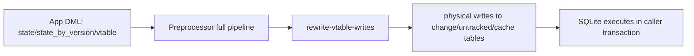

# Design Log #0002: Implement RFC 001 Preprocess Writes

## Background

See Design Log #0001 for architecture baseline.

RFC 001 (`rfcs/001-preprocess-writes/index.md`) proposes moving write handling out of SQLite vtable callbacks (`xUpdate`/`xCommit`) and into the SDK preprocessor.

Today, writes flow through:

- `state` and `state_by_version` INSTEAD OF triggers
- `lix_internal_state_vtable` callbacks
- per-row validation + side effects in JS

This adds high overhead for bulk writes.

## Problem

Per RFC 001, write operations should avoid vtable overhead and avoid the `lix_internal_transaction_state` staging table.

Current SDK internals are deeply coupled to `lix_internal_transaction_state` across:

- commit materialization,
- change view composition,
- version merge internals,
- read rewrite (`rewrite-vtable-selects`) candidate segments,
- runtime transaction flags and rollback handling.

So implementing RFC 001 as written is a cross-cutting migration, not a single preprocessor-step addition.

## Questions and Answers

### Q1: Should this implementation remove `lix_internal_transaction_state` now?

**Answer:** Yes. Implement RFC 001 as written.

### Q2: What write shapes are in scope for first implementation phase?

**Answer:**

- In scope: `INSERT ... VALUES`, `INSERT ... DEFAULT VALUES`, `UPDATE ... WHERE`, `DELETE ... WHERE`.
- Out of scope for first pass: `INSERT ... SELECT`.

### Q3: How should unsupported/unsafe write rewrites behave?

**Answer:** Follow existing read-preprocessor behavior: conservative/fail-safe fallback where rewrite cannot be guaranteed.

### Q4: How should validation semantics be preserved?

**Answer:** Reuse current validators first (same behavior contract), then optimize incrementally.

### Q5: What is the compatibility contract?

**Answer:** Keep public SQL/API behavior stable while changing internal write path architecture.

## Design

Replace vtable write execution with preprocessor-generated physical SQL and remove transaction-state staging.



### Phase annotations

- **Phase A (bridge):** add write rewrite step and prove parity for in-scope statements.
- **Phase B (migration):** remove transaction-state coupling from commit/change/merge/read-rewrite internals.
- **Phase C (cleanup):** remove obsolete schema/table/functions/tests.

### Type signatures (new/changed)

```ts
// new step
export const rewriteVtableWrites: PreprocessorStep

// likely helper contract for extracted validation + side effects
export type RewriteWriteResult = {
  statements: readonly SegmentedStatementNode[]
  rewritten: boolean
}
```

Validation rule contract for first pass:

- If statement shape is not fully understood, do not rewrite.
- If rewritten, enforce same constraints now enforced by `validateStateMutation(...)`.

## Exact Code Affected

### 1) Preprocessor pipeline + new rewrite step

- `packages/sdk/src/engine/preprocessor/create-preprocessor.ts`
  - Add `rewriteVtableWrites` into `fullPipeline` after entity-view DML rewrites.
- `packages/sdk/src/engine/preprocessor/steps/rewrite-vtable-writes.ts` (new)
  - Rewrite `INSERT`/`UPDATE`/`DELETE` targeting `state`, `state_by_version`, `lix_internal_state_vtable`.
  - Resolve active version for `state` writes.
  - Keep fallback behavior for unsupported shapes.
- `packages/sdk/src/engine/preprocessor/steps/rewrite-vtable-writes.test.ts` (new)

### 2) Remove transaction-state architecture

- `packages/sdk/src/state/transaction/schema.ts`
  - Remove DDL creation for `lix_internal_transaction_state`.
- `packages/sdk/src/state/transaction/insert-transaction-state.ts`
  - Delete or replace with new physical-write target helper(s).
- `packages/sdk/src/database/schema.ts`
  - Remove `lix_internal_transaction_state` from internal DB schema typing.

### 3) Rewrite vtable runtime dependencies

- `packages/sdk/src/state/vtable/vtable.ts`
  - Remove/neutralize `xUpdate` write path as primary route.
  - Remove transaction-table-based rollback/open-transaction checks.
  - Keep read vtable functionality only as needed for compatibility.
- `packages/sdk/src/state/vtable/commit.ts`
  - Replace commit flow currently sourced from transaction-state rows.
  - Re-anchor commit materialization to new write path outputs.

### 4) Rewrite read path assumptions that currently include transaction segments

- `packages/sdk/src/engine/preprocessor/steps/rewrite-vtable-selects.ts`
  - Remove transaction segment (`T`) and inherited transaction segment (`TI`) planning.
  - Recompute priority/ranking logic without transaction-state source.

### 5) Update other internals coupled to transaction table

- `packages/sdk/src/change/schema.ts`
  - Remove union branch that surfaces `lix_internal_transaction_state` in `change` view.
- `packages/sdk/src/version/merge-version.ts`
  - Remove read/delete logic against `lix_internal_transaction_state`.
- `packages/sdk/src/state/vtable/index.ts` (if exports need cleanup)

### 6) Tests and benches that must change

- `packages/sdk/src/state/vtable/vtable.test.ts`
- `packages/sdk/src/state/vtable/commit.test.ts`
- `packages/sdk/src/state/vtable/validate-state-mutation.test.ts`
- `packages/sdk/src/state/transaction/insert-transaction-state.test.ts`
- `packages/sdk/src/change/schema.test.ts`
- `packages/sdk/src/state/vtable/vtable.insert.bench.ts`
- `packages/sdk/src/state/vtable/commit.bench.ts`
- `packages/sdk/src/state/vtable/validate-state-mutation.bench.ts`

## Implementation Plan

### Phase 1: Add write preprocessor route

1. Add `rewrite-vtable-writes.ts` and wire into `fullPipeline`.
2. Implement in-scope rewrite targets (`INSERT VALUES/DEFAULT`, `UPDATE`, `DELETE`).
3. Keep fallback-safe behavior on unsupported shapes.

### Phase 2: Migrate away from transaction table

1. Remove transaction-table writes from runtime path.
2. Replace commit/materialization logic in `commit.ts`.
3. Update change/merge/read-rewrite logic that assumes pending transaction rows.

### Phase 3: Remove obsolete code + stabilize

1. Remove `lix_internal_transaction_state` schema/types/helpers.
2. Update all coupled tests/benches.
3. Validate behavior + performance targets from RFC.

## Examples

✅ Good first-pass rewrite target:

```sql
UPDATE state_by_version
SET snapshot_content = ?
WHERE schema_key = ? AND entity_id = ? AND version_id = ?
```

✅ Good fallback (first pass):

```sql
INSERT INTO state_by_version (...) SELECT ...
```

❌ Bad migration pattern:

- Keep `rewrite-vtable-selects.ts` transaction segments while removing `lix_internal_transaction_state`.

❌ Bad compatibility behavior:

- Changing public SQL contracts (`state`, `state_by_version`) during internal migration.

## Trade-offs

- Implements RFC intent fully, but touches many internals at once.
- Higher migration risk than incremental non-breaking approach.
- Conservative rewrite fallback reduces correctness risk but delays some performance wins until parser/rewrite coverage expands.

## Implementation Notes (planned)

- This work is an internal architecture migration with stable external API goals.
- Any behavior deviation must be recorded in an `Implementation Results` append section in this log.
