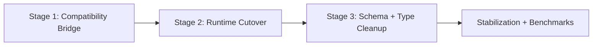

# Design Log #0003: Transaction Table Removal Cutover (Tasks 13-23)

## Background

See Design Log #0001 for architecture baseline and Design Log #0002 for RFC 001 write-preprocessor implementation.

In Design Log #0002, tasks 13-23 were cancelled due to high-risk cross-cutting dependencies around `lix_internal_transaction_state`.

This log defines a staged cutover plan to safely complete those cancelled tasks.

## Problem

`lix_internal_transaction_state` is currently a structural dependency in multiple runtime paths:

- commit materialization (`packages/sdk/src/state/vtable/commit.ts`)
- read rewrite source planning (`packages/sdk/src/engine/preprocessor/steps/rewrite-vtable-selects.ts`)
- change view composition (`packages/sdk/src/change/schema.ts`)
- merge flow (`packages/sdk/src/version/merge-version.ts`)
- vtable lifecycle logic (`packages/sdk/src/state/vtable/vtable.ts`)
- schema/type contracts (`packages/sdk/src/state/transaction/schema.ts`, `packages/sdk/src/database/schema.ts`)

Removing it without a staged migration risks correctness regressions in commit ordering, read visibility, and hook behavior.

## Questions and Answers

### Q1: What is the cutover strategy: big-bang or dual-path phased?

**Answer:** Dual-path phased (recommended). Keep compatibility switches during migration, then remove old path after parity is proven.

### Q2: Which behavior is source of truth during migration?

**Answer:** Existing behavior contracts from Design Log #0002 remain source of truth:

- public SQL/API behavior is non-breaking,
- validation semantics are preserved,
- conservative fallback remains in write preprocessing.

### Q3: What is the first gate for removing transaction table DDL/type definitions?

**Answer:** Only after commit + read rewrite + change + merge no longer query `lix_internal_transaction_state` in production paths.

### Q4: How is rollback safety handled?

**Answer:** Keep fallback path and feature guard until parity tests + benchmarks pass. If parity fails, revert to compatibility mode without schema churn.

### Q5: Which unresolved decision still needs confirmation?

**Answer (TBD):** Final storage source for pre-commit tracked writes (direct change rows vs alternate pending table/model) must be fixed before final deletion phase.

## Design

Use a three-stage cutover with explicit gates.

### Stage 1: Compatibility Bridge

Goal: decouple call sites while preserving current behavior.

- Introduce a write-source abstraction in SDK internals (Contract layer), used by commit/read-rewrite/change/merge.
- Implement adapters:
  - legacy adapter backed by `lix_internal_transaction_state`
  - new adapter backed by RFC write-preprocessor target model
- Keep default on legacy adapter until parity is verified.

### Stage 2: Runtime Cutover

Goal: switch production runtime reads/writes to the new adapter.

- Update:
  - `packages/sdk/src/state/vtable/commit.ts`
  - `packages/sdk/src/engine/preprocessor/steps/rewrite-vtable-selects.ts`
  - `packages/sdk/src/change/schema.ts`
  - `packages/sdk/src/version/merge-version.ts`
  - `packages/sdk/src/state/vtable/vtable.ts`
- Ensure all production queries stop referencing `lix_internal_transaction_state`.
- Preserve `state_commit` and related hook behavior.

### Stage 3: Schema + Type Cleanup

Goal: remove legacy artifacts once no production path references them.

- Remove or tombstone:
  - `packages/sdk/src/state/transaction/schema.ts`
  - `packages/sdk/src/state/transaction/insert-transaction-state.ts`
- Update internal DB types:
  - `packages/sdk/src/database/schema.ts`
- Remove stale tests/benches tied only to transaction table internals.

## Exact Code Affected

Primary migration files:

- `packages/sdk/src/state/vtable/commit.ts`
- `packages/sdk/src/engine/preprocessor/steps/rewrite-vtable-selects.ts`
- `packages/sdk/src/change/schema.ts`
- `packages/sdk/src/version/merge-version.ts`
- `packages/sdk/src/state/vtable/vtable.ts`

Schema/type cleanup files:

- `packages/sdk/src/state/transaction/schema.ts`
- `packages/sdk/src/state/transaction/insert-transaction-state.ts`
- `packages/sdk/src/database/schema.ts`

Test/benchmark files expected to change:

- `packages/sdk/src/state/vtable/commit.test.ts`
- `packages/sdk/src/state/vtable/vtable.test.ts`
- `packages/sdk/src/change/schema.test.ts`
- `packages/sdk/src/version/merge-version.test.ts` (if present; add if absent)
- `packages/sdk/src/state/vtable/vtable.insert.bench.ts`
- `packages/sdk/src/state/vtable/commit.bench.ts`

## Implementation Plan

### Phase 1 (maps to cancelled Tasks 13-16)

1. Implement runtime adapter interface and legacy/new adapters.
2. Move INSERT/UPDATE/DELETE write rewrite consumers to adapter API.
3. Prove parity with focused tests.

Exit criteria:

- no direct business logic outside adapter layer depends on transaction-table specifics.

### Phase 2 (maps to cancelled Tasks 17-21)

1. Cut commit/read-rewrite/change/merge/vtable runtime to adapter-backed model.
2. Run focused integration tests and typecheck/lint.

Exit criteria:

- production runtime paths have zero references to `lix_internal_transaction_state`.

### Phase 3 (maps to cancelled Tasks 15-16 and 22-23 cleanup)

1. Remove transaction table DDL/types/helpers.
2. Replace/remove obsolete tests and benches.
3. Capture benchmark deltas against RFC targets.

Exit criteria:

- green package tests/lint/typecheck,
- benchmarks show no regression and expected write-path improvement trend.

## Examples

✅ Good migration pattern:

- Introduce `PendingWriteStore` Contract with two adapters, migrate call sites one subsystem at a time.

✅ Good safety pattern:

- Keep fallback-compatible execution mode until parity suite passes.

❌ Bad migration pattern:

- Delete `lix_internal_transaction_state` schema before commit/read-rewrite no longer query it.

❌ Bad test strategy:

- Only benchmark success path, skip constraint/hook parity tests.

## Trade-offs

- Dual-path migration takes longer but lowers correctness risk.
- Temporary adapter indirection adds short-term complexity.
- Deferring schema deletion until runtime cutover avoids hard-to-recover breakages.

## Implementation Notes (planned)

- This design log is the execution plan for formerly cancelled tasks 13-23 in Design Log #0002.
- Upon each phase completion, append `Implementation Results` with changed files and test outcomes.
